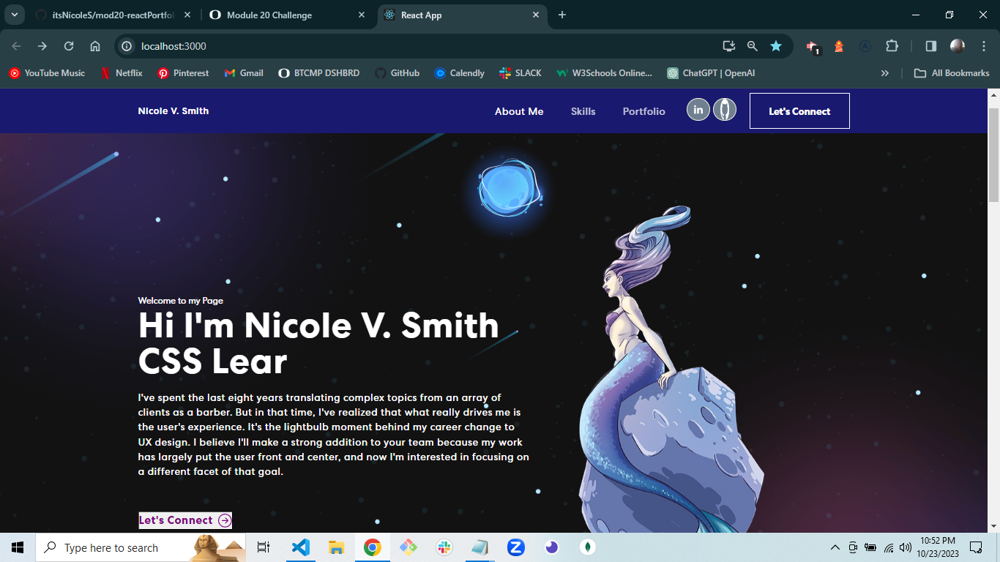

# <Mod20-React Portfolio>

## Description
A complete React Portfolio. 
Highlights Nav, different sections, a downloadable resume, and SPACE! 
Now I have a single link instead of attaching Resume and Cover Letter. 


## Table of Contents (Optional)

If your README is long, add a table of contents to make it easy for users to find what they need.

- [Installation](#installation)
- [Usage](#usage)
- [Credits](#credits)
- [License](#license)

## Installation
 "dependencies": {
    "@testing-library/jest-dom": "^5.17.0",
    "@testing-library/react": "^13.4.0",
    "@testing-library/user-event": "^13.5.0",
    "bootstrap": "^5.3.2",
    "cors": "^2.8.5",
    "express": "^4.18.2",
    "nodemailer": "^6.9.7",
    "react": "^18.2.0",
    "react-bootstrap": "^2.9.0",
    "react-bootstrap-icons": "^1.10.3",
    "react-dom": "^18.2.0",
    "react-multi-carousel": "^2.8.4",
    "react-router-hash-link": "^2.4.3",
    "react-scripts": "5.0.1",
    "web-vitals": "^2.1.4" }

## Usage

    ```md
    
    
    
    ```

## Credits
followed this tutorial: https://www.youtube.com/watch?v=hYv6BM2fWd8

## License
MIT
---